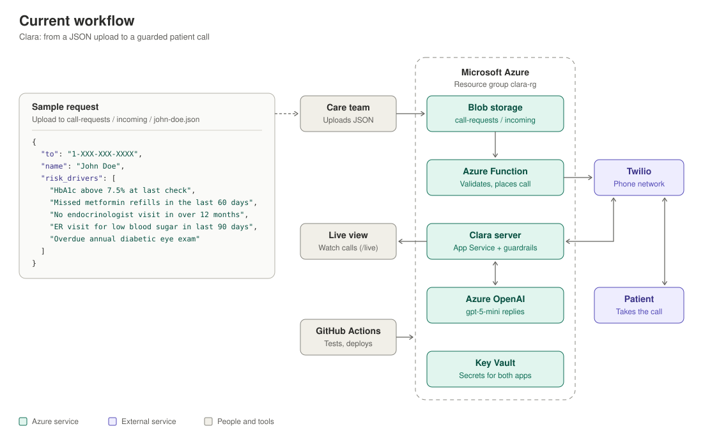

# HCM-Agent: Healthcare Voice Outreach Agent

An AI-powered voice outreach system designed to engage high-risk patients with personalized healthcare guidance, powered by an ML model that identifies at-risk individuals and flags key health drivers.

## What it does today

Meet **Clara**, a virtual assistant that calls patients on behalf of their health insurance care team. The current prototype can:

- 📞 **Hold a live phone conversation.** Clara calls a patient through Azure Communication Services, greets them, listens, and responds naturally, turn by turn.
- 🧠 **Generate replies with Claude or Azure OpenAI.** Uses Claude (`claude-opus-5`) or a model deployed in Azure AI Foundry, such as `gpt-5-mini`, chosen with the `LLM_PROVIDER` setting. Replies are based on the patient's name and risk drivers.
- 🛡️ **Enforce safety guardrails.** Clara never diagnoses, gives medical advice, or suggests medication changes; risky replies are replaced with a safe referral to the patient's doctor or care team.
- 🚨 **Handle emergencies.** Phrases like "chest pain" trigger an immediate 911 message and end the call.
- 👀 **Show calls live.** The `/live` page on the Azure server (password-protected) shows each call as it happens: what the patient said (with speech-confidence warnings), Clara's replies and response times, blocked replies, and emergencies.
- 📂 **Place calls from a file upload.** Uploading a small JSON file to an Azure storage container makes an Azure Function place the call, limited to approved numbers.
- 💬 **Run without a phone.** Text-only test modes let you chat with Clara or check the guardrails from the terminal.

**[→ Getting Started: setup and your first test call →](./docs/GETTING_STARTED.md)**

## Current workflow



1. **Upload a request.** A care team member uploads a JSON file to the `call-requests` storage container, in the `incoming/` folder.
2. **The Azure Function checks it.** It confirms the number is on the allow-list, the file is valid, and the hourly limit isn't reached. Then it asks Azure Communication Services (ACS) to dial.
3. **ACS calls the patient** from Clara's phone number, speaks Clara's words, and turns the patient's speech into text.
4. **The Clara server runs the conversation.** Replies come from Azure OpenAI and pass through safety guardrails before Clara speaks them.
5. **Watch it live** on the `/live` page.

Key Vault holds the secrets for both apps. GitHub Actions tests the code and deploys it to Azure on every merge to `main`.

**Sample request** ([`docs/samples/john-doe.json`](./docs/samples/john-doe.json)). Replace the number with one in `ALLOWED_CALL_NUMBERS` before uploading:

```json
{
  "to": "1-XXX-XXX-XXXX",
  "name": "John Doe",
  "risk_drivers": [
    "HbA1c above 7.5% at last check",
    "Missed metformin refills in the last 60 days",
    "No endocrinologist visit in over 12 months",
    "ER visit for low blood sugar in last 90 days",
    "Overdue annual diabetic eye exam"
  ]
}
```

> ⚠️ This is a development prototype. It is **not yet HIPAA-compliant** and must not be used with real patient data. The capabilities below describe the target design.

## Overview

**HCM-Agent** is designed to be a production-grade system that:

- 🎯 **Triggers on ML Predictions:** Flags high-risk diabetes patients with their top 5 health drivers
- 🗣️ **Conducts Real-Time Voice Conversations:** Uses streaming ASR/TTS for natural, low-latency interactions
- 📚 **Retrieves Approved Guidance:** RAG-powered system ensures all recommendations come from pre-approved company documents
- 🔐 **Maintains HIPAA Compliance:** End-to-end encryption, audit logging, and strict access controls
- 🤝 **Escalates Intelligently:** Routes complex cases to care managers, pharmacists, or emergency services as needed
- 📞 **Respects Patient Preferences:** Automatic Do-Not-Call (TCPA) compliance and preference management
- 🔧 **Executes Business Logic:** Schedules appointments, routes to PBMs, creates care tasks, and updates patient records

## Documentation

**[→ View the complete System Design & Implementation Guide →](./docs/DESIGN.md)**

The guide covers three major areas:

### 1. Architecture & Knowledge Retrieval
- ML model → agent pipeline
- RAG architecture for retrieving pre-approved documents
- Voice latency optimization (sub-1.5s round-trip)
- Context pre-computation and caching strategies

### 2. Prompt Engineering & Guardrails
- Core system prompt with strict medical boundaries
- "No medical opinions" enforcement
- Distress detection and emergency escalation
- HIPAA-compliant call logging and compliance documentation

### 3. Action Execution (Tool Calling)
- Tool taxonomy and design patterns
- Safety gates for all tool execution
- PBM (Pharmacy Benefit Manager) integration
- Care manager escalation decision trees
- Do-Not-Call (DNC) database and TCPA compliance

## Key Architecture Decisions

```
ML Model Flag (high-risk + top 5 drivers)
          ↓
Pre-Call Context Preparation (async)
          ↓
Voice Call Initiated (streaming ASR/TTS)
          ↓
Conversation Loop (RAG + Tool Planning + LLM)
          ↓
Post-Call Execution (tools, escalations, logging)
```

### Core Technologies

| Component | Recommended Stack |
|-----------|-------------------|
| **Voice Infrastructure** | Azure Communication Services (with Microsoft BAA) |
| **Speech Recognition** | Azure AI Speech (through Azure Communication Services) |
| **Text-to-Speech** | Azure AI Speech neural voices (through Azure Communication Services) |
| **LLM Agent** | Claude API or Azure OpenAI |
| **Vector DB (RAG)** | Pinecone / Weaviate |
| **Caching** | Redis |
| **Database** | PostgreSQL + encrypted storage |

## Development Roadmap

### Phase 1 (MVP)
- Core voice agent with single-threaded conversation
- Basic escalation to care managers
- System prompt with medical boundaries

### Phase 2
- RAG system integration
- EHR context retrieval
- Document approval workflow

### Phase 3
- Multi-turn conversation optimization
- Distress detection and emergency routing
- Tool execution for appointments/escalations

### Phase 4
- PBM integrations (refill requests, prior auth)
- Full compliance audit
- Pilot with patient subset

### Phase 5
- Scale to production
- Specialist routing
- Real-world outcome monitoring

## Getting Started

**[→ Setup and test-call guide →](./docs/GETTING_STARTED.md)**

The guide covers what works today, how a call flows through the app, setting up the model, Azure Communication Services (Clara's phone number) and Azure, and placing your first test call.

The Clara server runs on Azure App Service. See **[Deploying to Azure](./docs/DEPLOY_AZURE.md)** for deploying it and turning it on and off. Pushes to `main` redeploy the server and the call-request function automatically through GitHub Actions.

### Quick reference

```bash
pip install -e ".[dev]"      # installs the app, test tools and the clara-* commands
cp .env.example .env         # then fill in your keys, including the ACS_* phone settings

# Deploy (or update) the Clara server on Azure App Service
powershell -ExecutionPolicy Bypass -File .\deploy\azure\deploy.ps1 -AppName <your-app> -Location centralus

clara-chat interactive       # chat with Clara in the terminal
clara-server                 # run the phone server locally (development only)
clara-call --to +1XXXXXXXXXX --name <FirstName>   # calls through CLARA_BASE_URL (or pass --url)

# Deploy the Azure Function that places a call for each JSON file uploaded to storage
powershell -ExecutionPolicy Bypass -File .\deploy\azure\deploy_function.ps1 -FunctionApp <function-app> -ClaraAppName <your-app>
```

## Project Structure

```
hcm-agent/
├── src/hcm_agent/
│   ├── config.py               # Every setting, read from the environment and checked at startup
│   ├── agent/                  # The conversation "brain"
│   │   ├── conversation.py     # HCMVoiceAgent: one call's state, replies and guardrail enforcement
│   │   ├── llm.py              # Model backends: Claude or Azure OpenAI (LLM_PROVIDER)
│   │   ├── prompts.py          # System and emergency prompts
│   │   └── guardrails.py       # Diagnosis, advice, medication-change and emergency checks
│   ├── telephony/              # Phone calls through Azure Communication Services
│   │   ├── server.py           # Receives ACS call events and runs each turn, plus /live (clara-server)
│   │   ├── outbound.py         # Places outbound calls (allow-list, wake-up, ACS)
│   │   ├── call_requests.py    # Validates JSON call requests for the Azure Function
│   │   ├── live_feed.py        # In-memory event feed behind the live call view
│   │   └── static/live.html    # Live call view
│   └── cli/                    # Command-line tools
│       ├── place_call.py       # Places an outbound test call (clara-call)
│       ├── chat_demo.py        # Terminal chat with Clara, no phone needed (clara-chat)
│       └── mock_voice.py       # Terminal "call" interface used by clara-chat
├── functions/                  # Azure Function: places a call for each uploaded JSON request
├── tests/                      # Automated tests (no API calls, keys or phone needed)
├── deploy/azure/               # Deploy, start and stop scripts for App Service and the Function
├── docs/                       # Getting started, Azure deployment, full design
├── .github/workflows/          # CI (lint and tests), plus auto-deploys of the server and the Function
├── pyproject.toml              # Project metadata, commands, test and lint settings
├── requirements.txt            # Runtime dependencies (Azure installs from this)
├── .env.example                # Template for keys and settings
└── SECURITY.md                 # Handling secrets and what to do if one leaks
```

## Testing

```bash
pytest          # the automated tests
ruff check .    # code style
```

GitHub runs both on every push and pull request. The tests cover settings checks, the guardrails, both model backends and the phone server's call flow. They use stand-ins for Claude, Azure OpenAI and Azure Communication Services, so they run in seconds and cost nothing.

## Compliance & Security

⚠️ **Important:** This system handles Protected Health Information (PHI). Before deploying:

- [ ] Conduct HIPAA risk assessment
- [ ] Review with legal and compliance teams
- [ ] Implement encryption (TLS 1.2+, AES-256)
- [ ] Set up audit logging and breach detection
- [ ] Establish consent management workflows
- [ ] Configure DNC/TCPA compliance checks
- [ ] Test emergency escalation flows

See [DESIGN.md](./docs/DESIGN.md#hipaa--compliance-checklist) for the full compliance checklist.

## Contributing

Before contributing, review:
1. [DESIGN.md](./docs/DESIGN.md) for architecture
2. HIPAA compliance guidelines
3. The prompt engineering section for safety considerations

Run `python -m pytest` before opening a pull request.

## License

Proprietary – Healthcare Confidential

## Support

For technical questions or issues:
- Review the [full design guide](./docs/DESIGN.md)
- Check existing issues on GitHub
- Contact the development team

---

**Built with** ❤️ **for patient health and safety.**
