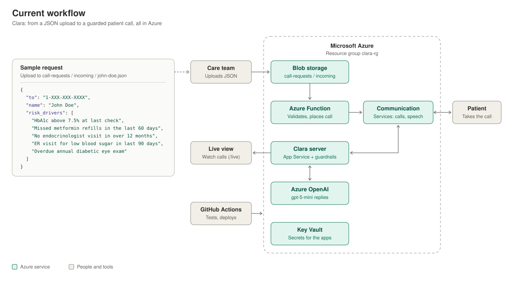

# Clara: AI voice outreach for high-risk diabetes patients

[](https://github.com/yashvadlamani/hcm-agent/actions/workflows/ci.yml)
[](https://github.com/yashvadlamani/hcm-agent/actions/workflows/deploy-server.yml)
[](https://github.com/yashvadlamani/hcm-agent/actions/workflows/deploy-function.yml)


**Clara** is an AI voice assistant that phones patients on behalf of their health insurance care team. She checks in on how they're managing their diabetes, listens, and responds naturally. She never gives medical advice, and she routes emergencies to 911.

> ⚠️ **Prototype.** Clara runs end to end on Azure with test data. It is **not yet HIPAA-compliant** and must not be used with real patient data. See the [roadmap](./docs/roadmap.md#path-to-real-patient-calls) for the path to production.

## How it works



1. **A call request is uploaded:** a small JSON file with the patient's number, name and risk drivers.
2. **An Azure Function validates it** (allow-list, format, hourly limit) and asks **Azure Communication Services** to dial.
3. **The Clara server runs the conversation.** Each turn, the patient's speech is transcribed, Azure OpenAI drafts a reply, and safety guardrails check it before Clara speaks.
4. **The care team watches live** on a password-protected web page.

More detail: [Architecture](./docs/architecture.md).

## Capabilities

| Capability | Status |
|---|---|
| Live two-way phone conversations (Azure Communication Services, Azure AI Speech) | ✅ Live |
| Replies personalized to the patient's name and risk drivers (Azure OpenAI or Claude) | ✅ Live |
| Safety guardrails: no diagnoses, no medical advice, no medication changes, no promises | ✅ Live |
| Emergency detection from context (clinical knowledge) plus keywords; 911 or the 988 crisis line | ✅ Live |
| Identity check before anything health-related; callback time noted if someone else answers | ✅ Live |
| Natural call endings ("anything else?") with a feedback-form opt-in | ✅ Live |
| Live patient sentiment score (0–1) on the dashboard | ✅ Live |
| Start calls by uploading a JSON file (Azure Functions + Event Grid) | ✅ Live |
| Live call dashboard with guardrail and emergency alerts | ✅ Live |
| Secrets in Azure Key Vault; automated tests and deploys (GitHub Actions) | ✅ Live |
| Patient eligibility checks (consent, Do-Not-Call, calling hours) | 🚧 Planned |
| Care-manager escalation and follow-up tasks | 🚧 Planned |
| Answers grounded in approved clinical content (RAG) | 🚧 Planned |
| HIPAA-ready production environment (BAA, purchased number, audit logging) | 🚧 Planned |

## Technology

| Layer | Technology |
|---|---|
| Phone calls, speech-to-text, text-to-speech | Azure Communication Services · Azure AI Speech |
| Conversation | Azure OpenAI (`gpt-5-mini`) or Anthropic Claude, with rule-based guardrails |
| Application | Python 3.12 · Flask on Azure App Service |
| Call requests | Azure Functions (Flex Consumption) · Blob Storage · Event Grid |
| Security | Azure Key Vault · managed identities |
| Delivery | GitHub Actions: lint, tests and automatic deploys on merge to `main` |

## Quick start

```bash
git clone https://github.com/yashvadlamani/hcm-agent.git && cd hcm-agent
python -m pip install -e ".[dev]"     # app, test tools and the clara-* commands
cp config/.env.example .env           # fill in your keys and phone settings
pytest                                # 84 tests, no keys or network needed
clara-chat demo                       # a sample conversation in the terminal
```

To set up Azure and place your first real call, follow [Setup and deployment](./docs/setup.md).

## Documentation

| Document | What's in it |
|---|---|
| [Architecture](./docs/architecture.md) | How Clara works: components, call flow, guardrails, security model, key decisions |
| [Setup and deployment](./docs/setup.md) | Install, phone number, deploy to Azure, automatic deploys, placing calls |
| [Operations](./docs/operations.md) | Health checks, on/off, logs, keys, phone numbers, costs, troubleshooting |
| [Roadmap](./docs/roadmap.md) | What's next, the path to real patient calls, project history |
| [Contributing and security](./docs/contributing.md) | Branch and PR workflow, standards, handling secrets |
| [Target design](./docs/target-design.md) | The long-term product vision |

## Repository layout

```
hcm-agent/
├── hcm_agent/              # Everything Clara runs on
│   ├── agent/              #   Conversation: prompts, model backends, guardrails
│   ├── telephony/          #   Calls: ACS event server, outbound calls, live dashboard
│   ├── cli/                #   clara-chat and clara-call
│   ├── azure_functions/    #   Azure Function: JSON upload → phone call
│   └── deploy/             #   Deploy, start and stop scripts for Azure
├── tests/                  # Automated tests
├── config/                 # .env.example: every setting, documented
├── docs/                   # Six documents (see above)
└── .github/                # CI, automatic deploys, PR template
```

## Contributing and security

Work happens on branches, through pull requests into `main`, and merging deploys automatically. Never commit secrets. Both are covered in [Contributing and security](./docs/contributing.md).

## License

Proprietary and confidential. See [LICENSE](./LICENSE).
