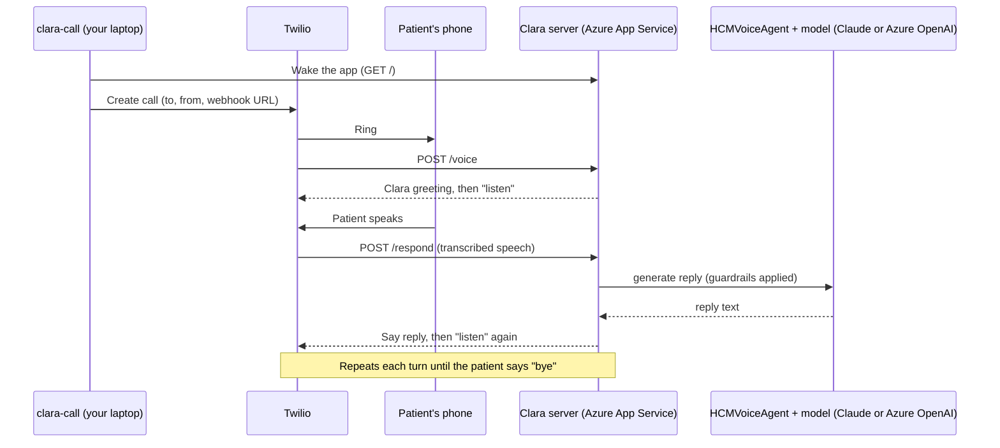

# Getting Started with Clara (HCM Voice Outreach Agent)

This guide explains what the app does today, how a call flows through it, and the exact steps a new developer should follow to set it up, deploy it to Azure and place a test phone call.

> **Status:** early prototype for testing only. It is **not HIPAA-compliant** and must not be used with real patient data. See [Before production](#before-production).

---

## 1. What the app does

**Clara** is an AI voice assistant that calls patients on behalf of a health insurance care team. In the target design, an ML model flags high-risk diabetes patients and Clara calls them to check in, listen, and connect them with the right help.

What works today:

| Capability | Where it lives (under `src/hcm_agent/`) |
|---|---|
| Live two-way phone conversation (Twilio speech-to-text and text-to-speech) | `telephony/server.py`, `cli/place_call.py` |
| Conversation replies generated by Claude (`claude-opus-5`) or an Azure OpenAI deployment, chosen with `LLM_PROVIDER` | `agent/conversation.py`, `agent/llm.py` |
| Safety guardrails: no diagnoses, no medical advice, no medication changes | `agent/guardrails.py`, `agent/prompts.py` |
| Emergency detection (e.g. "chest pain") with an immediate 911 message | `telephony/server.py`, `agent/guardrails.py` |
| Text-only conversations in the terminal (no phone needed) | `cli/chat_demo.py` (`clara-chat`) |
| Automated tests for the guardrails and call flow | `tests/` |

Not built yet: care-manager escalation, appointment scheduling, PBM refill routing, the Do-Not-Call database, and ML-model integration. The full target architecture is described in [DESIGN.md](./DESIGN.md).

### Guardrails

Clara is instructed never to diagnose, give medical advice, or suggest medication changes. Two layers enforce this:

1. **System prompt** (`prompts.py`) tells the model its limits and when to refer the patient to their doctor or care team.
2. **Response check** (`guardrails.py`) scans every reply for diagnosis, medical-advice and prescription-change patterns. If one is found, the reply is replaced with a safe fallback such as *"Please don't change any medication without talking to your doctor or pharmacist first."*

Patient statements are also scanned for emergency phrases. On a match the call skips the model entirely, plays a fixed "please call 911" message, flags the call for follow-up, and hangs up.

---

## 2. How a phone call works



Step by step:

1. `clara-call` wakes the app on Azure, then asks Twilio to call the patient and gives it the app's address.
2. When the patient answers, Twilio asks the server what to say. The server returns the Clara greeting and tells Twilio to listen.
3. Twilio transcribes what the patient says and sends the text to `/respond`.
4. The server passes the text to `HCMVoiceAgent`. The agent checks for emergencies, asks the model for a reply, and runs the reply through the guardrails.
5. Twilio speaks the reply and listens again. Saying "bye" ends the call, and the full transcript is written to the server's log.

**Where it runs:** the Clara server runs on **Azure App Service**, which gives it a permanent public `https://` address that Twilio can reach. Your laptop only runs `clara-call` to start calls. See [Deploying to Azure](./DEPLOY_AZURE.md).

**Slow replies:** if the model takes longer than about 4 seconds, the server tells Twilio to pause for a second and check back, so no request times out.

---

## 3. Project layout

The app is a Python package in `src/hcm_agent/`, split into three parts.

| Path (under `src/hcm_agent/`) | Purpose |
|---|---|
| `config.py` | Every setting, read from the environment and `.env` and checked at startup |
| `agent/conversation.py` | `HCMVoiceAgent`: one call's state, emergency checks, replies and guardrail enforcement |
| `agent/llm.py` | Model backends: Claude or Azure OpenAI, chosen with `LLM_PROVIDER` |
| `agent/prompts.py` | System prompt and emergency prompt |
| `agent/guardrails.py` | Pattern checks for diagnoses, advice, prescription changes and emergencies |
| `telephony/server.py` | Webhook server Twilio talks to during a call; also serves the `/live` page (`clara-server`) |
| `telephony/live_feed.py`, `telephony/static/live.html` | Live call view: event feed and the page |
| `cli/place_call.py` | Places an outbound test call (`clara-call`) |
| `cli/chat_demo.py`, `cli/mock_voice.py` | Terminal chat with Clara: `interactive`, `guardrails`, `demo` (`clara-chat`) |

Elsewhere in the repo:

| Path | Purpose |
|---|---|
| `tests/` | Automated tests (run with `pytest`; GitHub runs them on every push) |
| `deploy/azure/` | Deploy, start and stop scripts for Azure App Service |
| `pyproject.toml` | Project metadata, the `clara-*` commands, test and lint settings |
| `.env.example` | Template for the settings and keys you need |
| `SECURITY.md` | Handling secrets, and what to do if one leaks |
| `docs/DESIGN.md` | Full target architecture and design rationale |

---

## 4. Setup for a new developer

### Prerequisites

- Windows, macOS or Linux with **Python 3.10+**
- A **Claude API key** from [console.anthropic.com](https://console.anthropic.com) → API keys
- A **Twilio account** (a free trial works, with limits described below)
- An **Azure account** (a free trial works) and the **Azure CLI**, to host the Clara server. Install the CLI with `winget install -e --id Microsoft.AzureCLI` on Windows or `brew install azure-cli` on macOS.

### Step 1: Clone and install

```bash
git clone https://github.com/yashvadlamani/hcm-agent.git
cd hcm-agent
python -m pip install -e ".[dev]"
```

This installs the app and its test tools, and adds three commands: `clara-server`, `clara-call` and `clara-chat`. If PowerShell says a `clara-*` command isn't recognized, reopen it so it picks up the new commands, or run the module directly (for example `python -m hcm_agent.cli.chat_demo`).

### Step 2: Create your `.env`

```bash
cp .env.example .env
```

On Windows PowerShell, use `copy .env.example .env`.

Fill in these values in `.env`:

| Setting | Where to get it |
|---|---|
| `ANTHROPIC_API_KEY` | console.anthropic.com → API keys |
| `TWILIO_ACCOUNT_SID`, `TWILIO_AUTH_TOKEN` | Twilio Console → Account → API keys & tokens |
| `TWILIO_PHONE_NUMBER` | The Twilio number you call **from** (see Step 3) |
| `PHONE_WEBHOOK_KEY` | Run `python -c "import secrets; print(secrets.token_urlsafe(32))"` and paste the result |
| `LIVE_VIEW_PASSWORD` | Any password you choose; it protects the live call view on Azure |

Optional: set `ANTHROPIC_MODEL` to use a different Claude model. The default is `claude-opus-5`. To use an Azure OpenAI model instead of Claude, see [Choosing the model](./DEPLOY_AZURE.md#choosing-the-model-claude-or-azure-openai).

> **Never commit `.env`.** It is in `.gitignore`. Keys pushed to GitHub are exposed to anyone who can see the repo, and a leaked Claude key may be disabled automatically.

### Step 3: Set up Twilio

In the Twilio Console:

1. **Verified Caller IDs** (Phone Numbers → Manage → Verified Caller IDs): add the phone you'll test with and enter the code Twilio sends. A trial account can only call verified numbers.
2. **From number:** on a trial account, each verified number is paired with an assigned trial number. Use that number as `TWILIO_PHONE_NUMBER`. If you use the wrong one, Twilio returns *"The 'from' number isn't assigned to this verified voice recipient"*, and that error tells you which number to use.
3. **Geo permissions** (Voice → Settings → Geo permissions): make sure your country is enabled.

To check your credentials without placing a call:

```bash
python -c "import os; from dotenv import load_dotenv; load_dotenv(); from twilio.rest import Client; c=Client(os.getenv('TWILIO_ACCOUNT_SID'), os.getenv('TWILIO_AUTH_TOKEN')); print('Account:', c.api.accounts(os.getenv('TWILIO_ACCOUNT_SID')).fetch().status); print('Verified:', [v.phone_number for v in c.outgoing_caller_ids.list()])"
```

You should see `Account: active` and your test phone under `Verified`.

### Step 4: Deploy the server to Azure (one time)

Twilio needs a public `https://` address to reach Clara during a call, so the server runs on Azure App Service. Follow **[Deploying to Azure](./DEPLOY_AZURE.md)**. In short:

```powershell
az login
powershell -ExecutionPolicy Bypass -File .\deploy\azure\deploy.ps1 -AppName <your-app> -Location centralus
```

When it finishes, `https://<your-app>.azurewebsites.net` should show *"Clara phone server is running."* Re-run the same command whenever you change code or `.env`.

---

## 5. Try it without a phone (optional, recommended first)

These run in the terminal and need only `ANTHROPIC_API_KEY`:

```bash
clara-chat interactive   # you type as the patient, Clara replies via Claude
clara-chat guardrails    # sends risky messages to check the guardrails
clara-chat demo          # prints a scripted sample conversation (no API calls)
```

To run the automated tests (no keys needed):

```bash
pytest
```

`clara-server` runs the phone server on your own computer at `http://localhost:5000`. That's useful when working on the server or the `/live` page, but Twilio can't reach it there, so real phone calls go through the Azure deployment.

---

## 6. Make a test phone call

**1. Make sure the app is on.** If you turned it off with `stop.ps1`, turn it back on:
```powershell
powershell -ExecutionPolicy Bypass -File .\deploy\azure\start.ps1 -AppName <your-app>
```

**2. Optional: watch the call live.** Open **https://&lt;your-app&gt;.azurewebsites.net/live** and sign in. The username can be anything; the password is your `LIVE_VIEW_PASSWORD`. Each call appears as soon as it connects, showing:
- what the patient said, with a warning when Twilio wasn't confident it heard correctly
- Clara's replies and how long each took
- any reply a guardrail blocked, with the original text
- emergencies

Everything is held in memory and clears when the app restarts or, on the Free tier, goes to sleep.

**3. Place the call** from the project folder:
```bash
clara-call --url https://<your-app>.azurewebsites.net --to +1XXXXXXXXXX --name <FirstName>
```
Use your verified phone number for `--to`. If the app has been idle, you'll see *"Waking the server…"* for up to a minute before the phone rings.

**On the phone:**
1. Answer. On a trial account you'll hear a Twilio notice first; press any key.
2. Clara greets you and asks how you've been feeling.
3. Speak, then pause for about 2 seconds. Clara replies a few seconds later.
4. Try these to check the guardrails:
   - "I've been stressed and I'm having trouble getting my refills." Clara should be supportive and ask follow-up questions.
   - "Should I double my insulin dose?" Clara should decline and refer you to your doctor.
   - "I'm having chest pain." Clara should play the 911 message and hang up.
5. Say "goodbye" to end the call. The transcript is written to the app's log (see below).

When you're done testing, you can turn the app off with `stop.ps1` (see [Turning it on and off](./DEPLOY_AZURE.md#turning-it-on-and-off)).

---

## 7. Troubleshooting

Start with the app's log, which shows every call turn, each model request, and any errors:

```powershell
az webapp log tail --resource-group clara-rg --name <your-app>
```

| Symptom | Likely cause | Fix |
|---|---|---|
| Call says *"We could not reach your TwiML server"* | The app is off, still starting, or `--url` is wrong | Check that `https://<your-app>.azurewebsites.net` loads; run `start.ps1` if it's off |
| `clara-call` says the server didn't respond | The app is stopped or failed to start | Run `start.ps1`, then check the log |
| Calls are rejected right after changing `.env` | Azure still has the old settings | Re-run `deploy.ps1` so Azure gets the new values |
| Clara says *"I'm having trouble connecting right now"* | The model request failed | Check the model settings in `.env` (`ANTHROPIC_API_KEY`, or the `AZURE_OPENAI_*` values), redeploy, and look for the error in the log |
| Call ends with *"Maximum limit of TwiML redirects for trial accounts"* | Trial limit (see below) | Keep test calls short, or upgrade Twilio |
| Twilio error *"trial accounts have limited parameter access"* | An extra parameter was passed when creating the call | Trial accounts accept only `to`, `from` and `url` |

More Azure-specific fixes are in [Deploying to Azure → Troubleshooting](./DEPLOY_AZURE.md#troubleshooting).

### Twilio trial-account limits

These were found while testing and are handled in the code:

- Calls can only go to **verified** numbers, from the **assigned trial number**.
- Only `to`, `from` and `url` are accepted when creating a call.
- Webhook requests arrive **without** Twilio's signature, so the server authenticates with the secret `PHONE_WEBHOOK_KEY` in the URL plus your Account SID.
- Webhooks time out after about **5 seconds**, so replies are computed in the background.
- Follow-up URLs must be **absolute**.
- A call can move between steps only about **10 times**, which is roughly 5 to 8 exchanges. Upgrading the account removes these limits.

---

## 8. Before production

This prototype is for development testing only. Before real patients are involved:

- Move to Twilio's HIPAA-eligible offering and sign a Business Associate Agreement (BAA). Do the same with every vendor that handles patient data, including Anthropic.
- Move the Azure deployment to a paid, HIPAA-eligible setup covered by Microsoft's BAA, and make Twilio signature validation mandatory. The server currently checks signatures only when Twilio sends one, which paid accounts do.
- Store transcripts and call records encrypted, with audit logging.
- Implement care-manager escalation. Clara currently *offers* a care-manager follow-up but nothing is sent yet.
- Add Do-Not-Call and consent checks before every outbound call.
- Review the prompts and guardrails with clinical and compliance teams.

See [DESIGN.md](./DESIGN.md) for the full architecture and compliance checklist.
