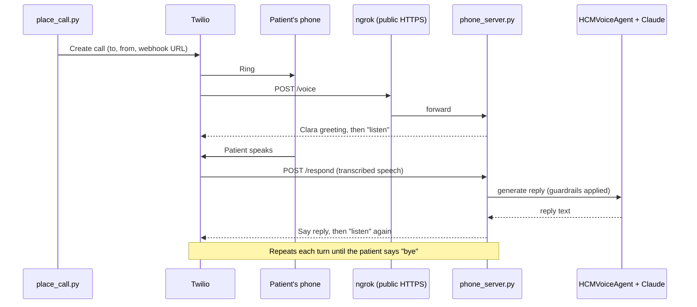

# Getting Started with Clara (HCM Voice Outreach Agent)

This guide explains what the app does today, how a call flows through it, and the exact steps a new developer should follow to run it locally and place a test phone call.

> **Status:** early prototype for testing only. It is **not HIPAA-compliant** and must not be used with real patient data. See [Before production](#before-production).

---

## 1. What the app does

**Clara** is an AI voice assistant that calls patients on behalf of a health insurance care team. In the target design, an ML model flags high-risk diabetes patients and Clara calls them to check in, listen, and connect them with the right help.

What works today:

| Capability | Where it lives |
|---|---|
| Live two-way phone conversation (Twilio speech-to-text and text-to-speech) | `hcm_agent/phone_server.py`, `hcm_agent/place_call.py` |
| Conversation replies generated by Claude (`claude-opus-5`) or an Azure OpenAI deployment, chosen with `LLM_PROVIDER` | `hcm_agent/agent.py` |
| Safety guardrails: no diagnoses, no medical advice, no medication changes | `hcm_agent/guardrails.py`, `hcm_agent/prompts.py` |
| Emergency detection (e.g. "chest pain") with an immediate 911 message | `hcm_agent/phone_server.py`, `hcm_agent/guardrails.py` |
| Text-only conversations in the terminal (no phone needed) | `hcm_agent/chat_demo.py` |
| Automated tests for the guardrails and call flow | `tests/` |

Not built yet: care-manager escalation, appointment scheduling, PBM refill routing, the Do-Not-Call database, and ML-model integration. The full target architecture is described in [DESIGN.md](./DESIGN.md).

### Guardrails

Clara is instructed never to diagnose, give medical advice, or suggest medication changes. Two layers enforce this:

1. **System prompt** (`prompts.py`) tells the model its limits and when to refer the patient to their doctor or care team.
2. **Response check** (`guardrails.py`) scans every reply for diagnosis, medical-advice and prescription-change patterns. If one is found, the reply is replaced with a safe fallback such as *"Any changes to your medications need to be discussed with your doctor."*

Patient statements are also scanned for emergency phrases. On a match the call skips the model entirely, plays a fixed "please call 911" message, flags the call for follow-up, and hangs up.

---

## 2. How a phone call works



Step by step:

1. `place_call.py` asks Twilio to call the patient and gives it the server's public URL.
2. When the patient answers, Twilio asks the server what to say. The server returns the Clara greeting and tells Twilio to listen.
3. Twilio transcribes what the patient says and sends the text to `/respond`.
4. The server passes the text to `HCMVoiceAgent`. The agent checks for emergencies, asks Claude for a reply, and runs the reply through the guardrails.
5. Twilio speaks the reply and listens again. Saying "bye" ends the call, and the full transcript is printed in the server's log.

**Why ngrok?** Twilio has to reach the server over the internet. ngrok gives your laptop a temporary public `https://` address that forwards to `localhost:5000`. To skip ngrok and run the server in the cloud, see [Deploying to Azure](./DEPLOY_AZURE.md).

**Slow replies:** if Claude takes longer than about 4 seconds, the server tells Twilio to pause for a second and check back, so no request times out.

---

## 3. Project layout

| Path | Purpose |
|---|---|
| `hcm_agent/agent.py` | `HCMVoiceAgent`: conversation state, Claude call, guardrail enforcement |
| `hcm_agent/guardrails.py` | Pattern checks for diagnoses, advice, prescription changes, emergencies |
| `hcm_agent/prompts.py` | System prompt and emergency prompt |
| `hcm_agent/phone_server.py` | Flask webhook server Twilio talks to during a call; also serves the `/live` page |
| `hcm_agent/live_feed.py`, `hcm_agent/static/live.html` | Live call view: event feed and the page |
| `hcm_agent/place_call.py` | Places an outbound test call |
| `hcm_agent/chat_demo.py` | Terminal chat with Clara: `interactive`, `guardrails`, `demo` |
| `hcm_agent/mock_voice.py` | Terminal "call" interface used by `chat_demo.py` |
| `tests/` | Automated tests (run with `python -m pytest`) |
| `.env.example` | Template for the settings and keys you need |
| `docs/DESIGN.md` | Full target architecture and design rationale |

---

## 4. Setup for a new developer

### Prerequisites

- Windows, macOS or Linux with **Python 3.10+**
- A **Claude API key** from [console.anthropic.com](https://console.anthropic.com) → API keys
- A **Twilio account** (a free trial works, with limits described below)
- An **ngrok account** (free) from [dashboard.ngrok.com/signup](https://dashboard.ngrok.com/signup)

### Step 1: Clone and install

```bash
git clone https://github.com/yashvadlamani/hcm-agent.git
cd hcm-agent
python -m pip install -r requirements.txt
```

### Step 2: Create your `.env`

```bash
cp .env.example .env
```

On Windows PowerShell, use `copy .env.example .env`.

Fill in these values in `.env`:

| Setting | Where to get it |
|---|---|
| `ANTHROPIC_API_KEY` | console.anthropic.com → API keys |
| `TWILIO_ACCOUNT_SID`, `TWILIO_AUTH_TOKEN` | Twilio Console → Account → API keys & tokens |
| `TWILIO_PHONE_NUMBER` | The Twilio number you call **from** (see Step 3) |
| `PHONE_WEBHOOK_KEY` | Run `python -c "import secrets; print(secrets.token_urlsafe(32))"` and paste the result |

Optional: set `ANTHROPIC_MODEL` to use a different Claude model. The default is `claude-opus-5`. To use an Azure OpenAI model instead of Claude, see [Choosing the model](./DEPLOY_AZURE.md#choosing-the-model-claude-or-azure-openai).

> **Never commit `.env`.** It is in `.gitignore`. Keys pushed to GitHub are exposed to anyone who can see the repo, and a leaked Claude key may be disabled automatically.

### Step 3: Set up Twilio

In the Twilio Console:

1. **Verified Caller IDs** (Phone Numbers → Manage → Verified Caller IDs): add the phone you'll test with and enter the code Twilio sends. A trial account can only call verified numbers.
2. **From number:** on a trial account, each verified number is paired with an assigned trial number. Use that number as `TWILIO_PHONE_NUMBER`. If you use the wrong one, Twilio returns *"The 'from' number isn't assigned to this verified voice recipient"*, and that error tells you which number to use.
3. **Geo permissions** (Voice → Settings → Geo permissions): make sure your country is enabled.

To check your credentials without placing a call:

```bash
python -c "import os; from dotenv import load_dotenv; load_dotenv(); from twilio.rest import Client; c=Client(os.getenv('TWILIO_ACCOUNT_SID'), os.getenv('TWILIO_AUTH_TOKEN')); print('Account:', c.api.accounts(os.getenv('TWILIO_ACCOUNT_SID')).fetch().status); print('Verified:', [v.phone_number for v in c.outgoing_caller_ids.list()])"
```

You should see `Account: active` and your test phone under `Verified`.

### Step 4: Set up ngrok (one time)

1. Install it. On Windows, run `winget install ngrok.ngrok`. On macOS, run `brew install ngrok`. You can also download it from the ngrok dashboard.
2. Copy your authtoken from the ngrok dashboard (Getting Started → Your Authtoken) and run:
   ```bash
   ngrok config add-authtoken <your-token>
   ```

---

## 5. Try it without a phone (optional, recommended first)

These run in the terminal and need only `ANTHROPIC_API_KEY`:

```bash
python -m hcm_agent.chat_demo interactive   # you type as the patient, Clara replies via Claude
python -m hcm_agent.chat_demo guardrails    # sends risky messages to check the guardrails
python -m hcm_agent.chat_demo demo          # prints a scripted sample conversation (no API calls)
```

To run the automated tests (no keys needed):

```bash
python -m pytest
```

---

## 6. Make a test phone call

Open **three terminals** in the project folder.

**Terminal 1: start the Clara server**
```bash
python -m hcm_agent.phone_server
```
Wait for `Clara phone server listening on http://127.0.0.1:5000`. Each conversation turn is logged here.

**Optional: watch the call live.** Open **http://localhost:5000/live** in your browser. Each call appears as soon as it connects, showing:
- what the patient said, with a warning when Twilio wasn't confident it heard correctly
- Clara's replies and how long each took
- any reply a guardrail blocked, with the original text
- emergencies

The page only works from your own computer: requests that come in through ngrok get a "not found" response. Everything is held in memory and clears when the server restarts.

**Terminal 2: start ngrok**
```bash
ngrok http 5000
```
Copy the `https://…` address from the `Forwarding` line.

**Terminal 3: place the call**
```bash
python -m hcm_agent.place_call --url https://<your-ngrok-address> --to +1XXXXXXXXXX --name <FirstName>
```
Use your verified phone number for `--to`.

**On the phone:**
1. Answer. On a trial account you'll hear a Twilio notice first; press any key.
2. Clara greets you and asks how you've been feeling.
3. Speak, then pause for about 2 seconds. Clara replies a few seconds later.
4. Try these to check the guardrails:
   - "I've been stressed and I'm having trouble getting my refills." Clara should be supportive and ask follow-up questions.
   - "Should I double my insulin dose?" Clara should decline and refer you to your doctor.
   - "I'm having chest pain." Clara should play the 911 message and hang up.
5. Say "bye" to end the call. The transcript appears in Terminal 1.

When you're done, press **Ctrl+C** in Terminals 1 and 2.

---

## 7. Troubleshooting

While ngrok is running, **http://127.0.0.1:4040** shows every request Twilio sent and what the server answered. Start there.

| Symptom | Likely cause | Fix |
|---|---|---|
| Call says *"We could not reach your TwiML server"* | Server or ngrok not running, or the wrong `--url` | Check Terminals 1 and 2; the `--url` must match ngrok's `https://` address |
| 4040 shows **404** | `PHONE_WEBHOOK_KEY` changed since the server started | Restart the server after editing `.env` |
| 4040 shows **502** | ngrok can't reach the server | Terminal 1 isn't running, or not on port 5000 |
| Clara says *"I'm having trouble connecting right now"* | Claude request failed | Check `ANTHROPIC_API_KEY`; the error is in Terminal 1 |
| Call ends with *"Maximum limit of TwiML redirects for trial accounts"* | Trial limit (see below) | Keep test calls short, or upgrade Twilio |
| Twilio error *"trial accounts have limited parameter access"* | An extra parameter was passed when creating the call | Trial accounts accept only `to`, `from` and `url` |
| Server seems frozen on Windows | You clicked inside the server's terminal, which pauses its output | Press **Esc** in that window |

### Twilio trial-account limits

These were found while testing and are handled in the code:

- Calls can only go to **verified** numbers, from the **assigned trial number**.
- Only `to`, `from` and `url` are accepted when creating a call.
- Webhook requests arrive **without** Twilio's signature, so the server authenticates with the secret `PHONE_WEBHOOK_KEY` in the URL plus your Account SID.
- Webhooks time out after about **5 seconds**, so replies are computed in the background.
- Follow-up URLs must be **absolute**.
- A call can move between steps only about **10 times**, which is roughly 5 to 8 exchanges. Upgrading the account removes these limits.

---

## 8. Before production

This prototype is for development testing only. Before real patients are involved:

- Move to Twilio's HIPAA-eligible offering and sign a Business Associate Agreement (BAA). Do the same with every vendor that handles patient data, including Anthropic.
- Deploy the server to proper hosting instead of ngrok, and make Twilio signature validation mandatory. The server currently checks signatures only when Twilio sends one, which paid accounts do.
- Store transcripts and call records encrypted, with audit logging.
- Implement care-manager escalation. Clara currently *offers* a care-manager follow-up but nothing is sent yet.
- Add Do-Not-Call and consent checks before every outbound call.
- Review the prompts and guardrails with clinical and compliance teams.

See [DESIGN.md](./DESIGN.md) for the full architecture and compliance checklist.
