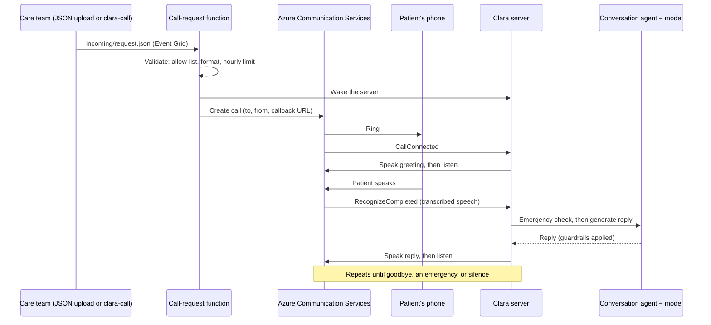

# Architecture

How Clara works today, and why it's built this way. For the long-term product vision, see the [target design](./target-design.md).

## Components

All Azure resources live in one resource group, `clara-rg`.

| Component | Azure service | Role |
|---|---|---|
| **Clara server** | App Service (Linux, Python 3.12) | Receives call events, runs each conversation turn, serves the live dashboard |
| **Call-request function** | Azure Functions (Flex Consumption) | Validates uploaded JSON requests and starts calls |
| **Call-request storage** | Blob Storage + Event Grid | The `call-requests/incoming/` inbox; Event Grid triggers the function for each new `.json` file |
| **Phone calls** | Azure Communication Services (ACS) Call Automation | Clara's phone number; dials patients, plays Clara's voice, transcribes the patient |
| **Speech** | Azure AI Services (Speech) | Neural text-to-speech and speech recognition, used by ACS |
| **Conversation model** | Azure OpenAI (`gpt-5-mini`), or Anthropic Claude | Drafts Clara's replies; `LLM_PROVIDER` picks one |
| **Secrets** | Key Vault | Keys and passwords, read by the apps through managed identities |
| **Delivery** | GitHub Actions | Lint and tests on every push; deploys on merge to `main` |

## How a call works

1. **Start.** A JSON request lands in `call-requests/incoming/`, or someone runs `clara-call`. The function checks the request, wakes the server and asks ACS to dial.
2. **Connect.** When the patient answers, ACS sends `CallConnected` to the server's callback address, and Clara greets the patient by name.
3. **Each turn.** ACS transcribes the patient and sends `RecognizeCompleted`. The server:
   1. checks for emergency phrases. On a match, it skips the model, plays a fixed 911 message and hangs up.
   2. asks the model for a reply based on the patient's name and risk drivers.
   3. runs the reply through the guardrails, replacing unsafe replies with a safe referral.
   4. asks ACS to speak and listen again.
4. **End.** The call ends on goodbye, after an emergency message, or after two silent turns. The transcript goes to the server log.

Each event is acknowledged immediately and handled in the background, so a slow model reply never times out the call.

## Guardrails

1. **System prompt** ([`prompts.py`](../hcm_agent/agent/prompts.py)): Clara must never diagnose, give medical advice or suggest medication changes, and refers the patient to their doctor or care team instead.
2. **Response check** ([`guardrails.py`](../hcm_agent/agent/guardrails.py)): every reply is scanned for diagnosis, medical-advice and prescription-change patterns. A match replaces it with a safe fallback.
3. **Emergency check:** patient statements are scanned for phrases such as "chest pain" before the model is ever called.

Every blocked reply and emergency appears on the live dashboard.

## Code layout

| Path | Purpose |
|---|---|
| [`hcm_agent/config.py`](../hcm_agent/config.py) | Every setting, read from the environment or `.env`, checked at startup |
| [`hcm_agent/agent/`](../hcm_agent/agent/) | The conversation: `conversation.py` (call state and guardrail enforcement), `llm.py` (Azure OpenAI or Claude), `prompts.py`, `guardrails.py` |
| [`hcm_agent/telephony/`](../hcm_agent/telephony/) | Calls: `server.py` (ACS events, `/live`), `outbound.py` (placing calls), `call_requests.py` (request validation), `live_feed.py` and `static/live.html` (dashboard) |
| [`hcm_agent/cli/`](../hcm_agent/cli/) | `clara-call` (place a call) and `clara-chat` (talk to Clara in the terminal) |
| [`hcm_agent/azure_functions/`](../hcm_agent/azure_functions/) | The call-request Azure Function, deployed separately |
| [`hcm_agent/deploy/`](../hcm_agent/deploy/) | Deploy, start and stop scripts, and the packaging script |
| [`tests/`](../tests/) | Automated tests, with stand-ins for ACS, the models and Azure Storage |
| [`config/.env.example`](../config/.env.example) | Every setting, documented |

The Azure Function and the deploy scripts live inside `hcm_agent/` for a tidy repository, but they aren't part of the app that runs on the server. The packaging script and `pyproject.toml` exclude them.

## Security model

| Concern | How it's handled |
|---|---|
| Secrets | `.env` locally (never committed); **Key Vault** in Azure, read through managed identities |
| Call events | ACS posts to a callback URL containing a secret key (`PHONE_WEBHOOK_KEY`); other requests are rejected |
| Who can be called | Only numbers in `ALLOWED_CALL_NUMBERS`, at most `MAX_CALLS_PER_HOUR` per hour; trial numbers can call only verified numbers |
| Live dashboard | Password over HTTPS on Azure, local-only otherwise; call text never rendered as HTML |
| Call-request storage | Private container; each file processed once (blob lease), then moved to `processed/` or `failed/` |
| Speech access | ACS uses its managed identity (Cognitive Services User), so there's no extra key |

Gaps before production are listed in the [roadmap](./roadmap.md#path-to-real-patient-calls).

## Key decisions

**Host on Azure App Service** (2026-09-30). The phone service needs a permanent public `https://` address. Early prototypes ran on a laptop behind a tunnel, which wasn't shareable or reliable. App Service gives managed HTTPS and a fixed address. The Free tier sleeps when idle, so callers wake it before dialing; Basic (B1) is always on. Calls are kept in memory in a single worker, so scaling out later needs shared call state. *Considered:* Container Apps (more setup than needed now) and Functions for the server (a poor fit for in-memory call state).

**Keep secrets in Key Vault** (2026-10-01). Secrets were first copied into plain app settings, and an early commit exposed keys that then had to be rotated. Now the deploy scripts write every secret to one Key Vault, and each app reads it through its own managed identity, which has read-only access. Developers keep a local `.env` so tests and local runs don't need Azure access. *Considered:* plain app settings (scattered and widely visible) and reading the vault on laptops too (every developer would need vault access).

**Azure OpenAI by default, with Claude as an option** (2026-09-30). Keeping the model in Azure puts everything under one subscription, bill and BAA. Both backends sit behind one interface and share the same prompts and guardrails, so switching is one setting. `gpt-5-mini` needs minimal reasoning effort to reply in about 2 seconds, fast enough for voice. *Considered:* either provider alone (less flexibility, or a second vendor).

**Azure Communication Services instead of Twilio** (2026-10-01). Twilio's trial had three problems: a roughly 5-second webhook deadline that forced a hold-and-poll workaround, a cap of about 10 redirects that cut calls short, and a "press any key" notice on every call. HIPAA use would also have needed a separate Twilio BAA. ACS keeps the whole system in Azure, and its event model removes those workarounds. A real call verified the switch: greeting, speech recognition, emergency handling and hang-up all worked. The Twilio version is preserved on the `twilio-main` branch. *Considered:* staying on Twilio, and other carriers (Vonage, Plivo, Bandwidth) tried during early prototyping.

## Current limitations

- **Calls stay in memory:** in-progress calls and dashboard history clear when the server restarts (deploys, Free-tier sleep).
- **One server process:** fine for a prototype; scaling out needs shared call state.
- **Trial phone number:** 30 days, up to 3 verified numbers, 60 outbound minutes, 5-minute calls.
